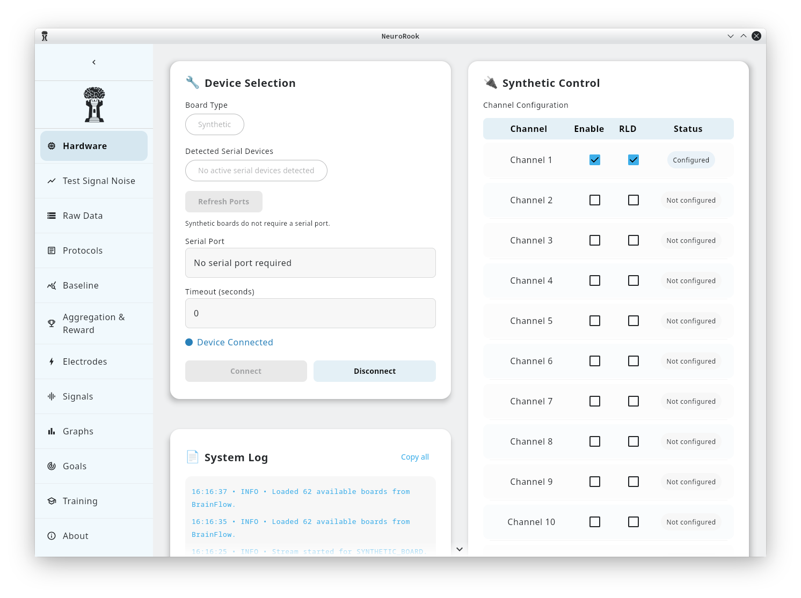

# NeuroRook

[](https://github.com/lukewilk/NeuroRook/actions/workflows/kover.yml)
[](LICENSE)

<p align="center">
  
</p>

---

## Overview

**NeuroRook** is a neurofeedback suite built on top of the [BrainFlow library](https://brainflow.org/). The project is in active development, with a primary focus on desktop (JVM) support and planned expansion to Android and iOS platforms. NeuroRook aims to provide a robust, extensible, and user-friendly environment for neurofeedback research and applications.

<p align="center">
  
</p>

---

## Features
- **Kotlin Multiplatform**: Shared business logic across JVM, Android, and iOS.
- **BrainFlow Integration**: Leverages BrainFlow for hardware-agnostic EEG and biosignal acquisition.
- **Modular Architecture**: Designed for extensibility and maintainability.
- **Cross-Platform UI**: Compose Multiplatform for a consistent user experience.

---

## Project Structure
- [`composeApp/`](./composeApp/src): Shared codebase for Compose Multiplatform applications.
- [`iosApp/`](./iosApp/iosApp): Entry point and UI for iOS applications (SwiftUI).
- [`androidApp/`](./androidApp/src): Android application module (planned).
- [`hardwareBackend/`](./hardwareBackend/src): Hardware abstraction and BrainFlow integration.
- [`shared/`](./shared/src): Common business logic and utilities.

---

## Getting Started

### Prerequisites
- **JDK 21** or later
- **Android Studio** (for Android/iOS development)
- **Gradle** (wrapper included)

### Build Instructions

#### Desktop (JVM)
*Note: Desktop support is under active development.*

- **Build:**
  ```sh
  ./gradlew :composeApp:build
  ```
- **Run:**
  ```sh
  ./gradlew :composeApp:run
  ```

#### Android
*Note: Android support is planned for future releases.*

- **Build APK:**
  ```sh
  ./gradlew :androidApp:assembleDebug
  ```
- **Install/Run:** Use Android Studio or `adb`.

#### iOS
*Note: iOS support is planned for future releases.*

- **Build/Run:**
  - Open `/iosApp/iosApp` in Xcode and run the project.

---

## Contributing

Contributions are welcome! Please open issues or submit pull requests for bug fixes, feature requests, or improvements. For major changes, please discuss them via issues first.

---

## License

This project is licensed under the MIT License. See the [LICENSE](LICENSE) file for details.

---

## Resources
- [Kotlin Multiplatform Documentation](https://www.jetbrains.com/help/kotlin-multiplatform-dev/get-started.html)
- [BrainFlow Documentation](https://brainflow.org/)
